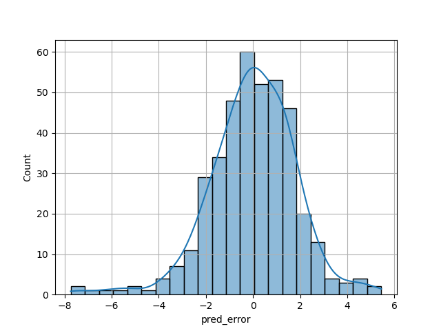

# Introduction
**TODO**

# Model

Our model is:
$$
\mbox{fuel consumption} =  0.00899249 \times \mbox{vehicle weight} -0.90305387
$$
where the fuel consumption is measured in liters per 100 km and the vehicle 
weight in kg.

# Error Distribution

Our model is practically unbiased 
$$
|\mbox{mean}| \leq 10^{-14}
$$
and its standard deviation is
$$
\mbox{std} \approx 1.815 < 2.0.
$$

# Dataset

Auto-mpg comes from @auto_mpg_9.

# References
